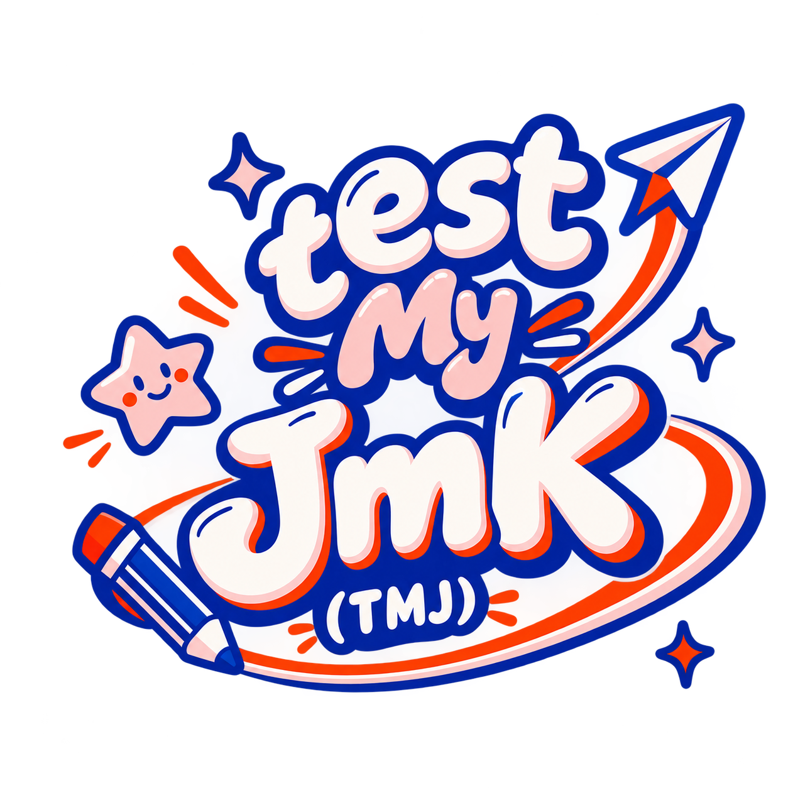
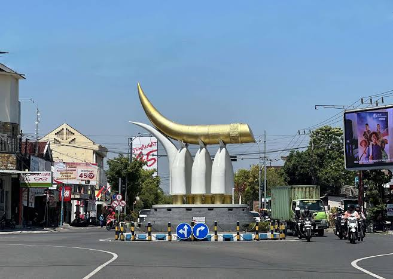

<p align="center">
  
</p>

<h1 align="center">TestMyJMK - Test Tingkat Kejomokan Mu</h1>

<p align="center">
  <em>Aplikasi Kuis Interaktif Berbasis Web untuk Menguji Tingkat Kejomokan Agar Tidak Terdeteksi Suki Liar.</em>
</p>

<p align="center">
  <a href="https://alfandoxeon.github.io/testmyjmk/"></a>
  
  
  
</p>

---

## 🌟 Visual Showcase & Meme Gallery

Aplikasi ini dilengkapi dengan ilustrasi khas budaya JMK dan latar belakang dinamis yang mengambang:

<p align="center">
  
</p>

<p align="center">
  <strong>Background Resmi:</strong> <em>Ayam Goreng Jumbo Asli Ngawi (Floating Backdrop Layer)</em>
</p>

### 🖼️ Galeri Soal & Ilustrasi:
| Suki Liar | Rusdi Suki | Tugu Ngawi | Kitab Rongawi Kuno |
| :---: | :---: | :---: | :---: |
|  |  |  |  |

---

## ⚡ Fitur Utama

- 🎯 **Single Page Application (SPA)**: Perpindahan 10 slide pertanyaan berlangsung dinamis tanpa reload halaman memanfaatkan JavaScript murni.
- 🏛️ **Arsitektur Bersih (MVC & OOP)**:
  - `QuizModel`: Mengelola state kuis, validasi kebenaran, kalkulasi statistik, dan penentuan tingkatan gelar/badge.
  - `QuizView`: Mengatur rendering antarmuka, transisi slide, animasi GSAP, dan kartu lencana sertifikat.
  - `QuizController`: Menjembatani event pengguna dan menyinkronkan data antar model dan view.
- ⚡ **Instant Real-Time Feedback**: Begitu tombol *Submit Jawaban* ditekan, status benar/salah langsung diumumkan detik itu juga lengkap dengan pembahasan.
- 🏆 **Sistem Lencana & Gelar Sertifikat**:
  - **Skor > 90 (Nilai 100)**: **Jomok Sejati** *(disertai Lencana Sertifikasi Resmi Ngawi Empire dengan nama user tercetak rapi)*.
  - **Skor 60 - 89**: **Jomok Medium** *(Pesan pembinaan)*.
  - **Skor 0 - 59**: **Suki Liar Terdeteksi** *(Peringatan bahaya)*.
- 🎵 **Backsound Otomatis (`ambatujssound.mp3`)**: Musik otomatis menyala saat user menekan *Mulai Test* (mematuhi browser autoplay policy) lengkap dengan tombol toggle mute/unmute di navbar.
- 🔊 **Sound Effects (SFX) Responsif**:
  - `mouse-click.mp3`: Suara klik renyah pada setiap penekanan tombol dan pemilihan kartu opsi jawaban.
  - `correct.mp3`: Suara apresiasi saat jawaban benar.
  - `incorrect.mp3`: Efek audio dramatis saat jawaban salah.
  - `yeay.mp3`: Suara selebrasi kegembiraan saat mencapai hasil *Jomok Sejati* (tinggi) & *Jomok Medium*.
  - `acumalaka.mp3`: Efek audio legendaris saat terdeteksi sebagai *Suki Liar*.
- 🎨 **Palet Warna Retro Modern**:
  - Primary Blue: `#093FB4`
  - Clean Surface: `#FFFCFB`
  - Peach Accent: `#FFD8D8`
  - Alert Red: `#ED3500`
- 🚫 **Bebas Emoji**: Seluruh indikator visual murni menggunakan **Google Material Symbols (Outlined)** demi estetika yang profesional dan konsisten.
- 🔍 **SEO Ready**: Dilengkapi Meta Tag lengkap, Open Graph, Twitter Cards, Canonical URL, dan Schema.org JSON-LD.

---

## 📂 Struktur Berkas

```
TestMyJMK/
│
├── .github/
│   └── workflows/
│       └── deploy.yml            # CI/CD otomatis deploy ke GitHub Pages
│
├── BackgroundImage/
│   └── AyamGorengJumbo.jpg       # Latar belakang animasi mengambang
│
├── backsound/
│   └── ambatujssound.mp3         # Musik backsound kuis
│
├── FolderImage/                  # Ilustrasi aset gambar soal
│   ├── kitab.jpg
│   ├── mykisah.webp
│   ├── rusdisuki.jpg
│   ├── suki.png
│   └── tugungawi.jpg
│
├── logoweb/
│   └── logoTJM.png               # Logo resmi TestMyJMK & Favicon
│
├── css/
│   └── style.css                 # Custom design system, typography & animations
│
├── js/
│   ├── questionsData.js          # Fallback data store (aman untuk protokol file://)
│   ├── model.js                  # Model Layer (OOP State & Logic)
│   ├── view.js                   # View Layer (DOM Manipulation & GSAP)
│   ├── controller.js             # Controller Layer (Event Coordination)
│   └── app.js                    # Application Entry Point
│
├── index.html                    # Single Page App Shell & SEO meta
├── pertanyaan.json               # Data pertanyaan kuis terstandarisasi
└── README.md                     # Dokumentasi proyek
```

---

## 🚀 Menjalankan Secara Lokal

1. **Clone repository ini**:
   ```bash
   git clone https://github.com/AlfandoXeon/testmyjmk.git
   cd testmyjmk
   ```

2. **Jalankan local web server**:
   - Dengan Python:
     ```bash
     python -m http.server 8080
     ```
   - Atau cukup klik ganda file `index.html` pada browser favorit Anda.

3. Akses aplikasi di browser pada:
   ```
   http://localhost:8080
   ```

---

## 🌐 Deployment (GitHub Pages)

Aplikasi ini telah dikonfigurasi untuk otomatis ter-deploy ke **GitHub Pages** menggunakan GitHub Actions (`.github/workflows/deploy.yml`).

Kunjungi live demo di:  
🔗 **[https://alfandoxeon.github.io/testmyjmk/](https://alfandoxeon.github.io/testmyjmk/)**

---

## 👤 Pengembang

Dikembangkan oleh **[AlfandoXeon](https://github.com/AlfandoXeon)** &bull; 2026.
